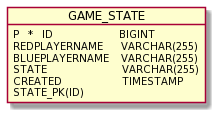

# 1. A rendszer céljai

Felhasználóknak egy asztali alkalmazás biztosítása, amelyet akár két felhasználó is használhat felváltva
a játék menete szerint.

- Magyar nyelvű felhasználói felület létrehozása.
- A játék lokális két-játékos módjának megvalósítása.
- Intuitív, bővebb leírást nem igénylő kezelői felület.
- Egyszerű, modern megjelenés biztosítása, az egyszerű kezelés céljából.
- Lehetőség biztosítása a jétékosoknak egyedi nevek megadására, ekkor mindkét játékos megadhatja a nevét (A magyar nyelvben előforduló karakterek támogatásával).
- Új játék kezdésének biztosítása, ekkor a tábla és a lépni következő jétékos neve is alapértelmezett állapotba kerülnek.
- Aktuális játék állapotának (játékos nevek és tábla állapota/korongok helye) elmentése.
- Egy korábban elmentet játék állapotának kitörlése.
- Egy adott játék állapot betöltése, ennek köszönhetően lehetőség van a játék folytatására az adott állapotból.
- A játékos tájékoztatása a játék során a megtehető lépések helyeiről a táblán.
- Platformfüggetlenség. 

# 2. A rendszer nem céljai

- A játékállásról visszajelző ablak a mentést követően üzenettel.
- Internet kapcsolat létrehozása, hogy a játék ne csak lokális keretek között legyen megvalósítható.
- Játékosok regisztrálása és beléptető mechanizmus biztosítása.
- A játékohoz tartozó animációk és reszponzív felhasználói felület biztosítása.
- Program bezárásakor figyelmeztető ablak megjelenítése.


# 3. Projekt terv

-

# 4. Üzleti folyamatok modellje

A játékos(ok)at a programot megnyitva egyből a kezdőállásba állított játék fogadja, alapértelmezett játékosnevekkel. A játékállapot mellett több gomb is rendelkezésre áll, különböző funkciókat kínálva:
- **Mentés:** Elmenti a játék jelenlegi állapotát, arésztvevő játékosok neveit és a mentés dátumát az adatbázisba.
- **Játék mentések:** Megmutatja az összes elmentett játékot és a hozzájuk tartozó információkat. A lista rendezhető a különböző oszlopok alapján, továbbá két művelet hajtható végre az adott játék mentéssel:
  - **Betöltés:** A kiválasztott mentés betöltése
  - **Törlés:** A kiválasztott mentés törlése az adatbázisból. Ezután semmilyen módon nem lehet elérni a törölt mentést.
- **Nevek megadása:** Az játékosnevek megváltoztatása, amelyek ki lesznek írva a soron következő játékos megállapítására. Továbbá segítenek azonosítani és megkülönböztetni a mentett játékokat a felhasználó számára.
- **Új játék:** A játék alaphelyzetbe állítása. A neveket nem változtatja meg.
- **Lépés:** A játéktér színesen jelölt mezőire (választható lépés) kattintva teheti meg a soron következő játékos a lépését. Ha nyerő lépést visz véghez az adott játékos, azt a program jelzi.

# 5. Követelmények

- Egy JavaFX asztali alkalmazás legyen.
- Az alkalmazásnak támogatnia kell a magyar nyelvet.
- Egy intuitív, részletes leírást nem igénylő, magyar nyelvű kezelői felület.
- Egyszerű, modern megjelenés.
- Biztosítson lehetőséget a játékállások elmentésére, betöltésére.
- Legyen a játékosoknak lehetőségük már meglévő játszmák, játékállások törlésére.
- A játékosoknak legyen lehetőségük megadni a játékosnevüket (A 2. pont alapján, minden magyar nyelvben előforduló karaktert el kell fogadnia).


# 6. Funkcionális terv

-

# 7. Fizikai környezet

-

# 9. Architekturális terv

#### Architekturális tervezési minta

A rendszer tervezési mintája a MVC (Model-View-Controller).

#### Az alkalmazás rétegei, fő komponensei, ezek kapcsolatai

- A Model komponens az adatokat és a funkcionalitást csomagolja be, független a kimenet
  ábrázolásmódjától vagy az input viselkedésétől.
- A View komponensek jelenítik meg az információkat a felhasználónak.
- A Controller fogadja a bemenetet, melyet szolgáltatáskérésekké alakít a Model vagy a View felé.

#### Változások kezelése

- Egyszerűen kezelhető változások hajthatóak végre, mivel interfészektől vagy absztrakt osztályoktól történik az objektumok függése, nem konkrét implementációktól, ezáltal az implementációk anélkül változtathatóak, hogy hatással lennének más objektumokra.

#### Rendszer bővíthetősége

- A rendszer bővítésre nyitott.

# 10. Adatbázis terv

### Logikai adatmodell:



### Fizikai adatmodellt legeneráló SQL szkript:

```sql
create table GameState (
        id bigint not null,
        bluePlayerName varchar(255) not null,
        created timestamp not null,
        redPlayerName varchar(255) not null,
        state varchar(255) not null,
        primary key (id)
    )
```

# 11. Implementációs terv


# 13. Telepítési terv

Az alkalmazás eléréséhez, telepítéséhez és futtatásához az alábbi feltételek/lépések szükségesek:

- Személyi számítógép Java JRE-vel ellátva
- Internetelérés (Az program beszerzéséhez)
- Webböngésző (Az program beszerzéséhez)

# 14. Karbantartási terv

Az alkalmazás jelenlegi és jövőbeli problémamentes használata érdekében folyamatosan frissítjük azt.
Legyen ez:
- Bugok javítása
- További optimalizáció
- Új kényelmi funkciók bevezetése felhasználói visszajelzések alapján
