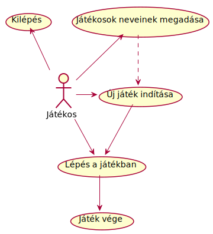

# 1. A rendszer céljai és nem céljai

### A rendszer céljai:

Felhasználóknak egy asztali alkalmazás biztosítása, amelyet akár két felhasználó is használhat felváltva
a játék menete szerint.

- Lehetőség biztosítása a jétékosoknak egyedi nevek megadására, ekkor mindkét játékos megadhatja a nevét.
- Új játék kezdésének biztosítása, ekkor a tábla és a lépni következő jétékos neve is alapértelmezett állapotba kerülnek.
- Aktuális játék állapotának (játékos nevek és tábla állapota/korongok helye) elmentése.
- Egy korábban elmentet játék állapotának kitörlése.
- Egy adott játék állapot betöltése, ennek köszönhetően lehetőség van a játék folytatására az adott állapotból.
- A játékos tájékoztatása a játék során a megtehető lépések helyeiről a táblán.

### A rendszer nem cáljai:

- Játékosok regisztrálása és beléptető mechanizmus biztosítása.
- A játékohoz tartozó animációk és reszponzív felhasználói felület biztosítása.
- Program bezárásakor figyelmeztető ablak megjelenítése.
- A játék elmentése során visszajelző ablak, üzenet kiírása.
- Internet kapcsolat létrehozása.

# 2. Jelenlegi helyzet leírása

-

# 3. Vágyálom rendszer leírása

-

# 4. Jelenlegi üzleti folyamatok modellje

-

# 5. Igényelt üzleti folyamatok modellje

-

# 6. Követelménylista

-

# 7. Használati esetek

Aktorok: _játékos_

Funkciók:

- játékosok neveinek megadása
- új játék indítása
- lépés a játékban
- játék vége
- kilépés

# 8. Megfeleltetés, hogyan fedik le a használati esetek a követelményeket

-

# 9. Képernyő tervek

-

# 10. Forgatókönyvek

Az alkalmazás megnyitásakor a főképernyő jelenik meg. Ezen a képernyőn jelenik meg a játékban használt tábla, amelyen a korongok kezdetben alul és felül helyezkednek. A tábla felett jelenik meg az éppen lépni következő játékos neve. Továbbá a név mellett, az alkalmazás jobb felső sarkában funkció gombok találhatóak.

##### Lehetőségek:

- Egy korongra kattint a lépni következő játékos a táblán, ekkor megjelennek zöld színnel a táblán azok a helyek, ahova
  léphet a játékos a választott koronggal.
- A játék megkezdése előtt beállítható a játékosok nevei egy gomb megnyomásával, ahol egy kis felugró ablakban van erre lehetőség.
- A játék megkezdése előtt lehetőség van egy régebbi, elmentet játék állapotát megjeleníteni. Egy gomb megnyomására egy új oldal jelenik meg, ahol kiválasztható egy listából egy játék állapot, amely egy név pár és egy dátummal van felcimkézve. Kiválasztást követően visszatér a főképernyőre, ahol az adott játék állapot jelenik meg.
- A játék folyamán lehetőség van egy gomb segítségével elmenteni az adott játék állását, játékos nevek és táblán
  lévő korongok helyét.
- A játék végén megjelenik a győztes neve a tábla felett, majd lehetőség van új játékot indítani egy gomb segítségével, amely kezdőállapotba helyezi a játék táblát és a nevek egy alapértermezett értéket vesznek fel.

Ha egy funkció nem elérhető a játék egy adott állapotában, akkor a funkciót elérő gomb nem kattintható, letiltásra kerül.

# 11. Funkció – követelmény megfeleltetés

-
