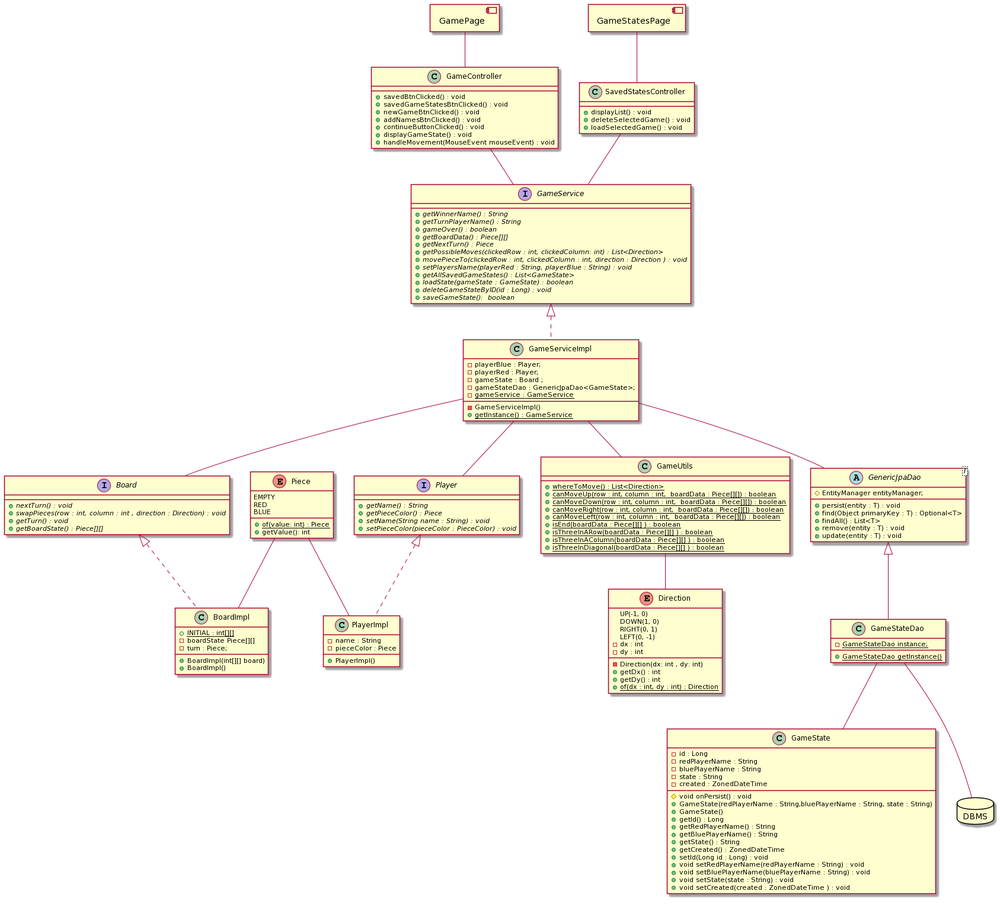

# 1. A rendszer céljai

-

# 2. A rendszer nem céljai

-

# 3. Projekt terv

-

# 4. Üzleti folyamatok modellje

-

# 5. Követelmények

-

# 6. Funkcionális terv

-

# 7. Fizikai környezet

-

# 8. Absztrakt domain modell

-

# 9. Architekturális terv

-

# 10. Adatbázis terv

# 11. Implementációs terv

# 12. Tesztterv

-

# 13. Telepítési terv

-

# 14. Karbantartási terv

-
