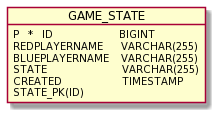

# 1. A rendszer céljai

Felhasználóknak egy asztali alkalmazás biztosítása, amelyet akár két felhasználó is használhat felváltva
a játék menete szerint.

- Magyar nyelvű felhasználói felület létrehozása.
- A játék lokális két-játékos módjának megvalósítása.
- Intuitív, bővebb leírást nem igénylő kezelői felület.
- Egyszerű, modern megjelenés biztosítása, az egyszerű kezelés céljából.
- Lehetőség biztosítása a jétékosoknak egyedi nevek megadására, ekkor mindkét játékos megadhatja a nevét (A magyar nyelvben előforduló karakterek támogatásával).
- Új játék kezdésének biztosítása, ekkor a tábla és a lépni következő jétékos neve is alapértelmezett állapotba kerülnek.
- Aktuális játék állapotának (játékos nevek és tábla állapota/korongok helye) elmentése.
- Egy korábban elmentet játék állapotának kitörlése.
- Egy adott játék állapot betöltése, ennek köszönhetően lehetőség van a játék folytatására az adott állapotból.
- A játékos tájékoztatása a játék során a megtehető lépések helyeiről a táblán.

# 2. A rendszer nem céljai

-

# 3. Projekt terv

-

# 4. Üzleti folyamatok modellje

-

# 5. Követelmények

-

# 6. Funkcionális terv

-

# 7. Fizikai környezet

-

# 9. Architekturális terv

#### Architekturális tervezési minta

A rendszer tervezési mintája a MVC (Model-View-Controller).

#### Az alkalmazás rétegei, fő komponensei, ezek kapcsolatai

- A Model komponens az adatokat és a funkcionalitást csomagolja be, független a kimenet
  ábrázolásmódjától vagy az input viselkedésétől.
- A View komponensek jelenítik meg az információkat a felhasználónak.
- A Controller fogadja a bemenetet, melyet szolgáltatáskérésekké alakít a Model vagy a View felé.

#### Változások kezelése

- Egyszerűen kezelhető változások hajthatóak végre, mivel interfészektől vagy absztrakt osztályoktól történik az objektumok függése, nem konkrét implementációktól, ezáltal az implementációk anélkül változtathatóak, hogy hatással lennének más objektumokra.

#### Rendszer bővíthetősége

- A rendszer bővítésre nyitott.

# 10. Adatbázis terv

### Logikai adatmodell:



### Fizikai adatmodellt legeneráló SQL szkript:

```sql
create table GameState (
        id bigint not null,
        bluePlayerName varchar(255) not null,
        created timestamp not null,
        redPlayerName varchar(255) not null,
        state varchar(255) not null,
        primary key (id)
    )
```

# 11. Implementációs terv


# 12. Tesztterv

-

# 13. Telepítési terv

-

# 14. Karbantartási terv

-
